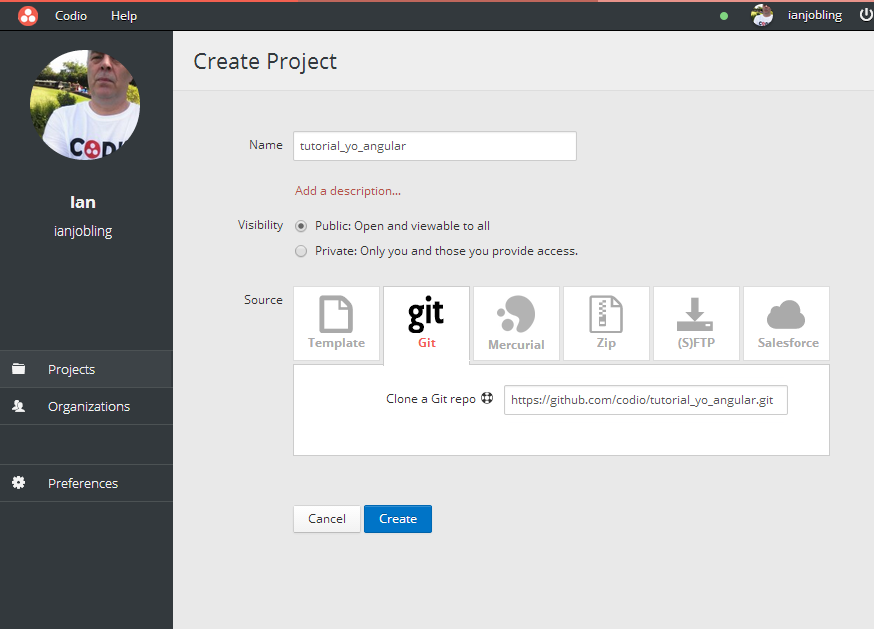

#ALLO! ALLO! LET'S SCAFFOLD A WEB APP

**By Addy Osmani, James Cryer & Pearl Chen with Annotation Tutorial by Codio**

In this code lab, you build a fully functional application using Yeoman and AngularJS. The sample app provides a brief look at some Yeoman, Grunt and Bower features. 

##IF YOU'VE COME FROM YEOMAN.IO SITE

**WARNING** : if you clicked in the yeoman.io site to get here, you will likely not have a Codio account, so you should sign up (select the 'Try Now' option). When completed you will be returned to the Codio dashboard and select the app to continue.

##RUNNING THE TUTORIAL IN CODIO

Running this tutorial in Codio is a great way to learn as you will see. The whole setup is much quicker than on your laptop and you can start work without having to set up a stack. Full instruction are below.

1. Create an account on Codio and sign in. 
1. Create a new project as shown above by selecting the Git tab
1. Paste into the 'Clone a Git repo' field `https://github.com/codio/tutorial_yo_angular.git`
1. When you press 'Create Project' you will be taken straight into the IDE
1. Go to the Tools->Tutorial menu option and simply follow the instructions

###Video
If you prefer to see how Codio works before you try this out, [here's a very short video](https://vimeo.com/88482886).

