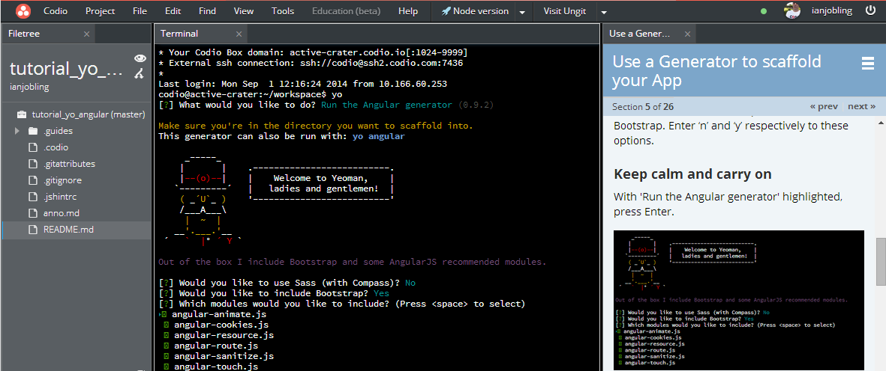
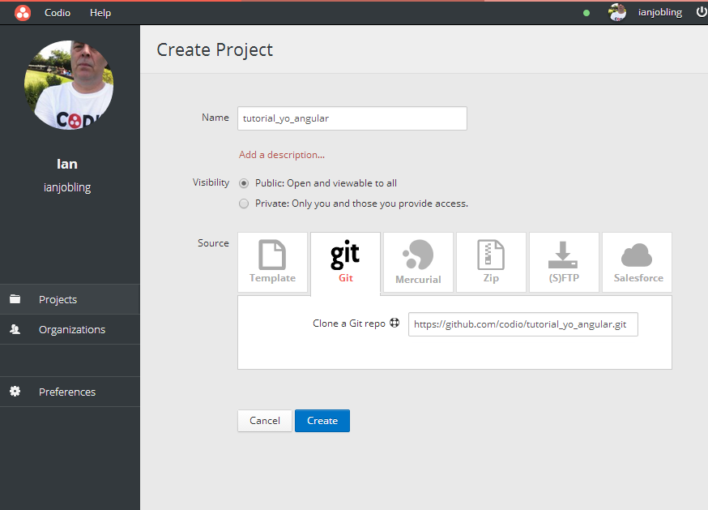

##ALLO! ALLO! LET'S SCAFFOLD A WEB APP WITH CODIO

**By Addy Osmani, James Cryer & Pearl Chen with Annotation Tutorial by Codio**

In this code lab, you build a fully functional  web application from scratch with the help of [Yeoman](http://yeoman.io/). You'll also use features from [Grunt](http://gruntjs.com/) and [Bower](http://bower.io/). The sample app will be written in [AngularJS](https://angularjs.org/).

Take a look at the image below. You can see the Codio IDE with 

- the step-by-step tutorial content in the right hand panel 
- your terminal and code windows on the left

So you can work your way through the tutorial really easily without having to switch windows or tabs.

##SETUP
Getting going is trivial ...

1. [Create an account on Codio](https://codio.com/p/signup) (you can sign up with GitHub) and sign in. 
1. Create a new project clicking the Create Project button and then, as shown above, select the Git tab.
1. Paste into the 'Clone a Git repo' field `https://github.com/codio/tutorial_yo_angular.git`.
1. When you press 'Create' you will be taken straight into the IDE.
1. Go to the Tools->Guides(Beta)>Play menu option and simply follow the instructions.

###Video
If you'd like to see how Codio and this Codelab tutorial work together, [here's a very short video](https://vimeo.com/88482886).

