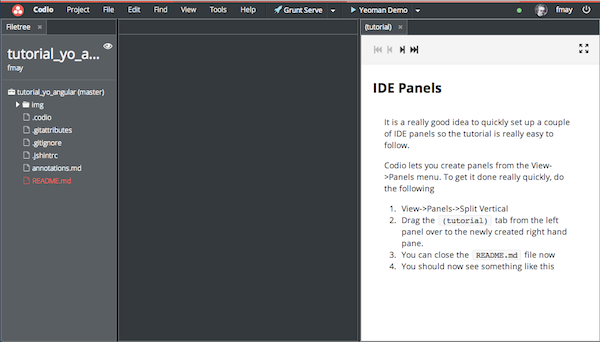
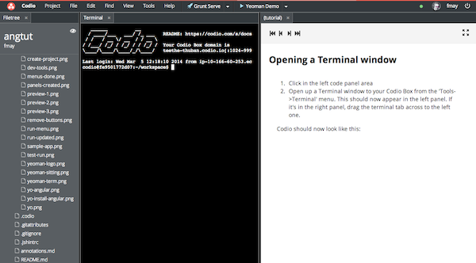
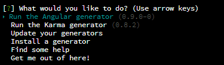
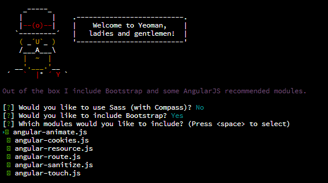
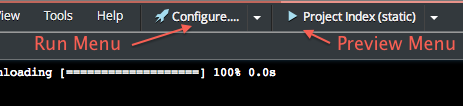
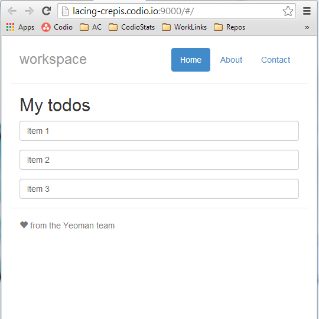
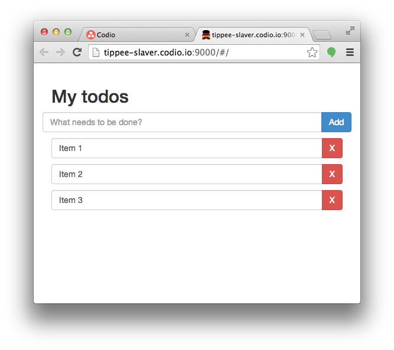
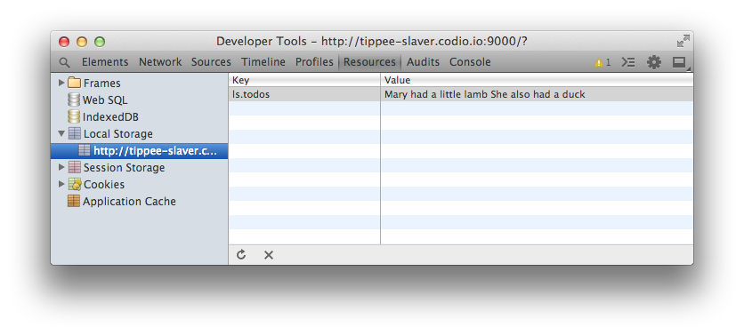
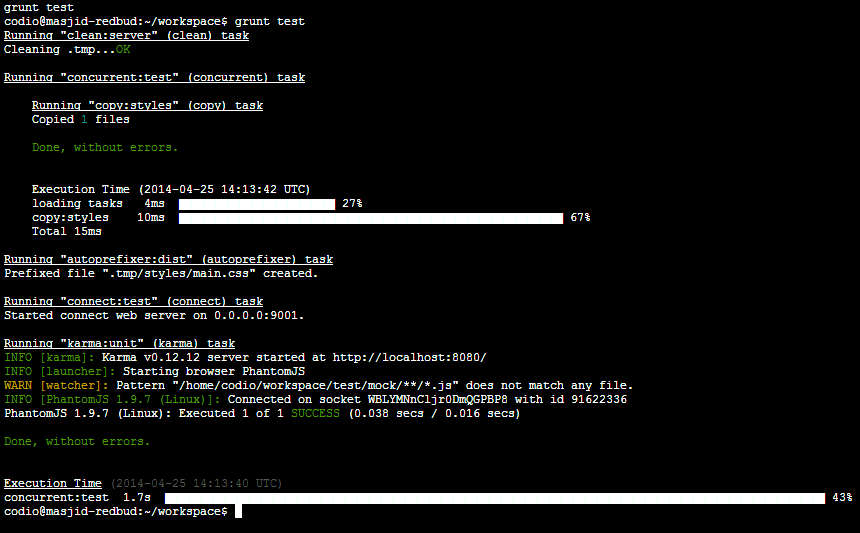

@annotation:tour
#IDE Panels
It is a really good idea to quickly set up a couple of IDE panels so the tutorial is really easy to follow.

Codio lets you create panels from the View->Panels menu. To get it done really quickly, do the following

1. View->Panels->Split Vertical
1. Drag the `(tutorial)` tab from the left panel over to the newly created right hand empty tab bar area.
1. You can close the `README.md` file now
1. You should now see something like this

Use the navigation buttons at the top to move to the next step.

@annotation:tour
##MEET YEOMAN

Yeoman is a man in a hat with three tools for improving your productivity:

[yo](http://yeoman.io/) is a scaffolding tool that offers an ecosystem of framework-specific scaffolds, called generators, that can be used to perform some of the tedious tasks I mentioned earlier.

[grunt](http://gruntjs.com/) is used to build, preview and test your project, thanks to help from tasks curated by the Yeoman team and [grunt-contrib](https://github.com/gruntjs/grunt-contrib).

[bower](http://bower.io/) is used for dependency management, so that you no longer have to manually download your front-end libraries.

With just a command or two, Yeoman can write boilerplate code for your app (or individual pieces like Models), compile your Sass, and fire up a simple web server in your current directory. It can also run your unit tests, minimize and concatenate your CSS, JS, HTML and images, plus more.

You can install generators using the [npm](http://npmjs.org/) command and there are over [450 generators](http://yeoman.io/community-generators.html) now available, many of which have been written by the open-source community. Popular generators include [generator-angular](https://github.com/yeoman/generator-angular), [generator-backbone](https://github.com/yeoman/generator-backbone) and [generator-ember](https://github.com/yeoman/generator-ember).

##TODAY’S SAMPLE YEOMAN APP: A TODO APP USING ANGULARJS

For those unfamiliar with AngularJS, it is a JavaScript framework for developing dynamic web apps. Angular is what HTML would have been if it had been designed for web apps, instead of static documents. Angular aims to simplify application development by providing high-level features like data-binding and dependency injection (DI).

To dig deeper into the sweet spots of AngularJS, take a look at the detailed [documentation](http://docs.angularjs.org/guide).

Let’s dive right into building the below Todo app from scratch.

@annotation:tour 
#Opening a Terminal window
1. Click in the left code panel area
1. Open up a Terminal window to your Codio Box from the 'Tools->Terminal' menu. This should now appear in the left panel. If it's in the right panel, drag the terminal tab across to the left one.

Codio should now look like this:

@annotation:tour 
#Installing Yeoman
Now we're ready to get going with the tutorial proper.

Let's install Yeoman. In your terminal window type

    npm install -g yo

Now sit back and wait. If you were to do this on your laptop on a normal ADSL connection, it would be a LOT slower.

Once the Yeoman installation is complete, you can check the version that was installed

    yo --version && bower --version && grunt --version

@annotation:tour
#Installing Yeoman Generators
In a traditional web development workflow, you would need to spend a lot of time setting up boilerplate code for your webapp, downloading dependencies, and manually creating your web folder structure. Yeoman generators to the rescue! Generators do the hard work for you by scaffolding out your project. Let’s install a generator for creating AngularJS projects.

Yeoman comes with a handy interactive menu, to access this menu run:

    $ yo

Use your keyboard’s up / down arrow keys to navigate the menu and hit enter when ‘Install a generator’ is highlighted.

Next we need to search for a generator to install. A search for `angular` will find many generators contributed by various members of the Yeoman open source community. In this instance we want to install the ‘generator-angular’ generator.

With generator-angular selected, hit enter to start installing the generator. This will start to install the Node packages required for the generator.

Alternatively, if you already know the name of the generator you want to use, the generator can be installed using npm as follows:

    $ npm install -g generator-angular

@annotation:tour
#Use a Generator to scaffold your App

Once a generator has been installed, you will automatically see the screen below (or it can be accessed via the Yeoman interactive menu: `$ yo`.
    
    

###Comments
As you become more familiar with Yo, you might want to run generators directly without the use of the interactive menu:

    $ yo angular    
    
Some generators will also provide optional settings to customize your app with common developer libraries and speed up the initial setup of your development environment.

The AngularJS generator provides options to include use Sass (with Compass) and/or Twitter Bootstrap. Enter ‘n’ and ‘y’ respectively to these options.

###Keep calm and carry on
With 'Run the Angular generator' highlighted, press Enter.

Next you are prompted to select what Angular modules you would like to include as well. Angular modules are self-contained JavaScript files with helpful functionality. For example, the ngResource module (angular-resource.js) provides interaction support with RESTful services.

You can deselect options using the spacebar. Let’s roll with the defaults. (So if you have been playing around with the spacebar, make sure that all the modules are marked as green.)

Okay, hit enter once your inputs look like you see above. Yeoman will automatically scaffold out your app, grab your dependencies, and pull in a few useful Grunt tasks for your workflow. After a short wait it will be ready.

Don't worry if you see a log error like this

    npm ERR!                                                
    npm ERR! Additional logging details can be found in:
    npm ERR!     /home/codio/workspace/npm-debug.log 
    npm ERR! not ok code 0 

@annotation:tour
#Explore the File Tree
In the file tree on the left, take a look at what was actually scaffolded. We have:

- **app**: a parent directory for our web application
  - **index.html**: the base html file for our Angular app
  - **404.html**, **favicon.ico**, and **robots.txt:** commonly used web files so you don’t have to create them yourself
  - **bower_components**: a home for our JavaScript/web dependencies, installed by Bower
  - **scripts**: our own JS files
  - **app.js**: our main application code
  - **controllers**: our Angular controllers
  - **styles**: our CSS files
  - **views**: a place for our Angular templates
- **Gruntfile.js**, **package.json**, and **node_modules**: configuration and dependencies required by our Grunt tasks
- **test** and **karma.conf.js/karma-e2e.conf.js**: a scaffolded out test runner and the unit tests for the project, including boilerplate tests for our controllers.

@annotation:tour
#Modify Gruntfile.js
To run properly in Codio, you'll want to open up `Gruntfile.js` in the root of your App and search for 'localhost' (somewhere around line 64) and change this

    // Change this to '0.0.0.0' to access the server from outside.
    hostname: 'localhost',
    livereload: 35729
        
to this

    // Change this to '0.0.0.0' to access the server from outside.
    hostname: '0.0.0.0',
    livereload: 4000    

Codio leaves all Ports between 1024 and 9999 at your disposal, so we need to modify the livereload port. 

@annotation:tour
#Setting up the Codio menus
Codio has the ability to save you lots of time by configuring the 'Run' menu (cli commands) and the 'Preview' menu. 

Click on 'Configure...' as shown in the Run menu below.

Now, copy and paste the following code into the code tab to save you the hassle ...

    {
    // Configure your Run and Preview buttons here.

    // Run button configuration
      "commands": {
        "Grunt Serve": "grunt serve",
        "Grunt Test": "grunt test",
        "Grunt Build": "grunt",
        "Grunt Serve:Dist": "grunt serve:dist"
      },

    // Preview button configuration
      "preview": {
        "Yeoman Demo": "http://{{domain}}:9000/"
      }
    }

You will now see that the Run and Preview menus have been updated and look like this ...

@annotation:tour
#Running & Previewing the App
##Start Grunt
Right, we are now ready to get Grunt to serve up our content. From the Run menu, select 'Grunt Serve' (If it appears in the upper panel covering the tutorial, then drag it down to the lower panel). 

This does nothing more than save you the hassle of typing on the command line ...

    grunt serve

You should see your terminal window running `grunt serve`. If there are any issues running Grunt, just run `npm install` from the terminal to make sure all packages got correctly installed.

##Preview
Now, from the Preview menu to the right, select 'Yeoman Demo'. Again, this is just a shortcut to ...

    http://{{domain}}:9000/

You should now see the following screen appear in a new browser tab.

@annotation:tour
#Live Reload
With both `grunt serve` still running in the background and the Preview tab still open, open up the file `app/views/main.html` and change some text somewhere. You will notice that the browser tab auto reloads the content.

@annotation:tour
#Create a new Template to show a ToDo list
###app/views/main.html
First, let's modify our view (views/main.html) to output our todos items as text input fields. Copy and paste the following code into the `app/views/main.html` file (replace everything).

    

      <h2>My todos</h2>
      

        <input type="text" ng-model="todo" class="form-control">
      

    

###app/scripts/controllers/main.js
Now, let's modify the controller script by replacing everything with ...

    'use strict';

    angular.module('workspaceApp')
      .controller('MainCtrl', function ($scope) {
        $scope.todos = ['Item 1', 'Item 2', 'Item 3'];
      });

The [ng-repeat](http://docs.angularjs.org/api/ng.directive:ngRepeat) attribute on the paragraph tag is an [Angular directive](http://docs.angularjs.org/guide/directive) that instantiates a template once per item from a collection. In our case, imagine that the paragraph element and its content is turned into a virtual rubber stamp by adding the ng-repeat attribute. For each item in the todos array, Angular will stamp out a new instance of the `
<input>
` HTML.

The [ng-model](http://docs.angularjs.org/api/ng.directive:ngModel) attribute is another Angular directive that works with input, select, textarea and custom controls to create a two-way data binding. In our example, it populates a text input field with the value from the current todo item in the ng-repeat loop.

Your browser should now show something like this

@annotation:tour
#Adding a ToDo
Let’s implement a way to add new todo items to the list of existing todos within the application.

Modify `app/views/main.html` by adding a form element in between the `<h2>` and `
` elements from the previous section. Your views/main.html should now look like this:

    

      <h2>My todos</h2>

      <!-- Todos input -->
      <form role="form" ng-submit="addTodo()">
        

          

            <input type="text" ng-model="todo" placeholder="What needs to be done?" class="form-control">
            
              <input type="submit" class="btn btn-primary" value="Add">
            
          

        

      </form>
      

      <!-- Todos list -->
      

        <input type="text" ng-model="todo" class="form-control">
      

    

This adds a form with a submit button to the top of the page. It utilises another Angular directive, [ng-submit](http://docs.angularjs.org/api/ng.directive:ngSubmit) which we’ll get to next. Return to your browser and the UI should now look similar to this:

@annotation:tour
#Making the Add button work
If you click the Add button currently, nothing will happen - let’s change that.

`ng-submit` binds an angular expression to the onsubmit event of the form. If no action attribute is applied to the form, it also prevents the default browser behaviour. In our example we’ve added an angular expression of `addTodo()`.

The following `addTodo` function pushes new todo items onto the existing todo items array and then clears the text input field. Let's add the following code inside the existing code

    $scope.addTodo = function () {
      $scope.todos.push($scope.todo);
      $scope.todo = '';
    };

So, your `app/scripts/controllers/main.js` should now look like this  ...

    'use strict';

    angular.module('workspaceApp')
      .controller('MainCtrl', function ($scope) {
        $scope.todos = ['Item 1', 'Item 2', 'Item 3'];
        $scope.addTodo = function () {
          $scope.todos.push($scope.todo);
          $scope.todo = '';
        };
      });

View the app in the browser again. Type some text in the input field for a new todo item and hit the Add button. It will be immediately reflected in your todos list. Here you can see I have added 2 new todos.

**Note**: if you enter in more than one blank todo item, or a todo item with the same name, your todo app will unexpectedly stop working. :( As a fun exercise on your own time, enhance the addTodo function with error checking.

@annotation:tour
#Adding a Remove Button
Let’s now add the ability to remove a todo item. We’ll need to add a new remove button alongside each todo item.

Going back to our view template (app/views/main.html), add a button to the existing `ng-repeat` directive. And to make sure our input field and remove button line up nicely, change the class on the paragraph tag from "form-group" to “input-group”.

Replace the stuff below `<!-- Todos list -->` with this code

    <!-- Todos list -->
    

      <input type="text" ng-model="todo" class="form-control">
      
        <button class="btn btn-danger" ng-click="removeTodo($index)" aria-label="Remove">X</button>
      
    

then run your app again, and you should get this ...

We introduced a new Angular directive above, [ng-click](http://docs.angularjs.org/api/ng.directive:ngClick). ng-click allows you to specify custom behaviours when an element is clicked. In this instance, we call `removeTodo()` and pass `$index` to the function.

The value of `$index` will be the array index of the current todo item within the ng-repeat directive. For example, the first item will have an array index of 0 and `removeTodo` will be passed the value of 0. Similarly, the last item of a todo list with 5 items will have an array index of 4 and `removeTodo` will be passed a value of 4.

@annotation:tour
#Making the remove buttons work
Let’s now add some logic for removing todo items to our controller. The following `removeTodo` function removes one todo item from the items array using the JavaScript `splice` method at the given `$index` value:

    $scope.removeTodo = function (index) {
      $scope.todos.splice(index, 1);
    };

The complete controller (app/scripts/controllers/main.js) with the new `removeTodo` function is below:

    'use strict';

    angular.module('workspaceApp')
      .controller('MainCtrl', function ($scope) {
        $scope.todos = ['Item 1', 'Item 2', 'Item 3'];
        $scope.addTodo = function () {
          $scope.todos.push($scope.todo);
          $scope.todo = '';
        };
        $scope.removeTodo = function (index) {
          $scope.todos.splice(index, 1);
        };
      });

Now you can use the 'x' buttons to remove items.

One thing you might notice is that although we’re able to add and remove items, we don’t have a way to persist them. Any time we refresh the page our todo items are reset back to the defaults in our todos array hardcoding in `main.js`. 

Don’t worry, we’ll fix this later after we learn more about installing packages with Bower.

@annotation:tour
#Using Bower to install angular-local-storage
We can check what packages we have already installed with:

    $ bower list

To easily achieve persistence, we can use another Angular module called [angular-local-storage](http://gregpike.net/demos/angular-local-storage/demo.html) that will allow us to quickly implement [Local Storage](http://diveintohtml5.info/storage.html). Bower comes to the rescue. Run the following command:

    $ bower install --save angular-local-storage

and you'll see something like this ...

@annotation:tour
#Modifying index.html for Local Storage
There are now 4 tutorial steps you'll run through to get persistant storage up and running, so don't start previewing just yet!

Modify `app/index.html` to include the new Angular module by adding the following after the other Angular script tags:

    
    
**Note**: if using `bower.json`, you may need to Ctrl+C to exit the current `grunt serve` instance, run `bower install` and then re-run `grunt serve` to get some automated magic in your `index.html`.

Your `index.html` scripts should now look like this:

    
    
    
    
    
    
    
    

@annotation:tour
#Modifying app/scripts/app.js for Local Storage

**IMPORTANT**: don't modify `main.js` by mistake. I made this mistake a couple of times setting this all up!

Edit the todo module (app/scripts/app.js) to include the `localStorage` adapter:

    angular.module('workspaceApp', [
      'ngCookies',
      'ngResource',
      'ngSanitize',
      'ngRoute',
      'LocalStorageModule'
    ])

While you’re in `app.js`, also configure `localStorageServiceProvider` to use ‘todo’ as a `localStorage` name prefix so your app doesn’t accidently read todos from another app using the same variable names:

    .config(['localStorageServiceProvider', function(localStorageServiceProvider){
      localStorageServiceProvider.setPrefix('ls');
    }])

Our todo module (app/scripts/app.js) should now look like this:

    'use strict';

    angular.module('workspaceApp', [
      'ngCookies',
      'ngResource',
      'ngSanitize',
      'ngRoute',
      'LocalStorageModule'
    ]);
      .config(['localStorageServiceProvider', function(localStorageServiceProvider){
        localStorageServiceProvider.setPrefix('ls');
      }])
      .config(function ($routeProvider) {
        $routeProvider
          .when('/', {
            templateUrl: 'views/main.html',
            controller: 'MainCtrl'
          })
          .otherwise({
            redirectTo: '/'
          });
      });
      
@annotation:tour
#Modifying app/scripts/controllers/main.js for Local Storage
You will also need to update your controller (scripts/controllers/main.js) to declare a dependency on the `localStorage` service. Add `localStorageService` as the second parameter in the callback function.

    'use strict';

    angular.module('workspaceApp')
      .controller('MainCtrl', function ($scope, localStorageService) {
        // (code hidden here to save space)
      });

So now, rather than reading our todos from a static array, we’ll be reading it from Local Storage and then storing it in `$scope.todos` instead.

We’ll also use the angular [$watch](http://docs.angularjs.org/api/ng.$rootScope.Scope#methods_$watch) listener to watch for changes in the value of `$scope.todos`. If someone adds or removes a todo, it will then keep our `localStorage` todos datastore in sync.

Therefore, we need to remove the current `$scope.todos` declaration:

    $scope.todos = ['Item 1', 'Item 2', 'Item 3'];

And replace it with this:

    var todosInStore = localStorageService.get('todos');

    $scope.todos = todosInStore && todosInStore.split('\n') || [];

    $scope.$watch('todos', function () {
      localStorageService.add('todos', $scope.todos.join('\n'));
    }, true);

We now have a controller that is as follows:

    'use strict';

    angular.module('workspaceApp')
      .controller('MainCtrl', function ($scope, localStorageService) {

        var todosInStore = localStorageService.get('todos');

        $scope.todos = todosInStore && todosInStore.split('\n') || [];

        $scope.$watch('todos', function () {
          localStorageService.add('todos', $scope.todos.join('\n'));
        }, true);

        $scope.addTodo = function () {
          $scope.todos.push($scope.todo);
          $scope.todo = '';
        };

        $scope.removeTodo = function (index) {
          $scope.todos.splice(index, 1);
        };

      });

If you look at your app in the browser now you’ll see that there are no items in the todo list. The app is initialising the todos array from `localStorage` and we haven’t given it any todo items yet.

Go ahead and refresh the browser and start adding some items. Then refresh the browser and you'll see everything persisting nicely.

@annotation:tour
#Checking in Dev Tools
We can confirm whether our data is being persisted to `localStorage` by checking the Resources panel in Chrome DevTools and selecting "Local Storage" from the lefthand side:

Pat yourself on the back! You just used Yeoman to build a snazzy todo app in no time. Can you imagine doing front-end web development in any other way now?

So to recap, in this section we:

- Scaffolded the boilerplate for an application using `yo`
- Installed dependencies to improve the functionality in our app with `bower`
- Used `grunt serve` to build and preview an interim version of our app. All our edits resulted in a live reload of the page giving us a nice real-time view of what we authored.

@annotation:tour
#Getting Ready for Production
##Testing with Karma and Jasmine
For those unfamiliar with Karma, it is a JavaScript test runner that is test framework agnostic. The Angular generator has two included test frameworks: ngScenario and Jasmine. When we ran yo angular earlier in this Codelab, the generator scaffolded a test directory in the root folder, created a `karma.conf` file, and pulled in the Node modules for Karma. We’ll be editing a Jasmine script to describe our tests soon but let’s see how we can run tests first.

Kill `grunt server` using Ctrl+C or just open up another terminal window from the Tools->Terminal menu. 

There is already a grunt task scaffolded out in our `Gruntfile.js` for running tests. It can be executed in one of two ways

1. From the Run menu, select 'Grunt Test' from the drop down list
2. From the cli, run `grunt test`

When you run `grunt test`, you will see a new browser window open and close, and some warnings in the Yeoman console. Don’t worry, that’s to be expected right now.

Our tests are currently failing as we haven’t updated the boilerplate test which still references `awesomeThings`. We also need to update the Karma configuration to load the the new Bower components into the browser. Open **`/karma.conf.js`** and replace the "files" array with:

    files: [
      'app/bower_components/jquery/jquery.js',
      'app/bower_components/jquery-ui/ui/jquery-ui.js',
      'app/bower_components/angular/angular.js',
      'app/bower_components/angular-ui/build/angular-ui.js',
      'app/bower_components/angular-mocks/angular-mocks.js',
      'app/bower_components/angular-local-storage/angular-local-storage.js',
      'app/scripts/*.js',
      'app/scripts/**/*.js',
      'test/mock/**/*.js',
      'test/spec/**/*.js',
      'app/bower_components/angular-resource/angular-resource.js',
      'app/bower_components/angular-cookies/angular-cookies.js',
      'app/bower_components/angular-sanitize/angular-sanitize.js',
      'app/bower_components/angular-route/angular-route.js'
    ],

and replace 'Chrome' with 'PhantomHS', too (Codio Boxes will support Chrome shortly, but does not yet)

    // Start these browsers, currently available:
    // - Chrome
    // - ChromeCanary
    // - Firefox
    // - Opera
    // - Safari (only Mac)
    // - PhantomJS
    // - IE (only Windows)
    browsers: ['PhantomJS'],

Or, just replace everything with this ...

    // Karma configuration
    // http://karma-runner.github.io/0.10/config/configuration-file.html

    module.exports = function(config) {
      config.set({
        // base path, that will be used to resolve files and exclude
        basePath: '',

        // testing framework to use (jasmine/mocha/qunit/...)
        frameworks: ['jasmine'],

        // list of files / patterns to load in the browser
        files: [
          'app/bower_components/jquery/jquery.js',
          'app/bower_components/jquery-ui/ui/jquery-ui.js',
          'app/bower_components/angular/angular.js',
          'app/bower_components/angular-ui/build/angular-ui.js',
          'app/bower_components/angular-mocks/angular-mocks.js',
          'app/bower_components/angular-local-storage/angular-local-storage.js',
          'app/scripts/*.js',
          'app/scripts/**/*.js',
          'test/mock/**/*.js',
          'test/spec/**/*.js',
          'app/bower_components/angular-resource/angular-resource.js',
          'app/bower_components/angular-cookies/angular-cookies.js',
          'app/bower_components/angular-sanitize/angular-sanitize.js',
          'app/bower_components/angular-route/angular-route.js'
        ],

        // list of files / patterns to exclude
        exclude: [],

        // web server port
        port: 8080,

        // level of logging
        // possible values: LOG_DISABLE || LOG_ERROR || LOG_WARN || LOG_INFO || LOG_DEBUG
        logLevel: config.LOG_INFO,

        // enable / disable watching file and executing tests whenever any file changes
        autoWatch: false,

        // Start these browsers, currently available:
        // - Chrome
        // - ChromeCanary
        // - Firefox
        // - Opera
        // - Safari (only Mac)
        // - PhantomJS
        // - IE (only Windows)
        browsers: ['PhantomJS'],

        // Continuous Integration mode
        // if true, it capture browsers, run tests and exit
        singleRun: false
      });
    };

@annotation:tour
#Modify test main.js
Next, modify the unit test for your `main.js`. You’ll find the tests scaffolding out in the `test` folder, so open up `test/spec/controllers/main.js`.

Delete the following:

    it('should attach a list of awesomeThings to the scope', function () {
      expect(scope.awesomeThings.length).toBe(3);
    });

And replace that test with the following:

    it('should have no items to start', function () {
      expect(scope.todos.length).toBe(0);
    });

Re-running our tests with grunt test should see our tests passing. Don't worry about the warnings. We're not using `jquery-ui` or `angular-ui`.

You should see something like this ...

Fantastic!

Writing unit tests make it easier to catch bugs as your app gets bigger and when more developers join your team. The scaffolding feature of Yeoman makes writing unit tests easier so no excuse for not writing your own tests! ;)

@annotation:tour
#Building for Production

Ready to show your beautiful todo app to the world? Let’s try to create a production version of our application. We’ll want to lint our code, run our tests, concatenate and minify our scripts and styles to save on those network requests, optimize images if we were using any, compile the output of any preprocessors we’re using and in general make our application really lean. Phew!

Amazingly we can achieve all of this just by running Grunt in one of 2 ways

- from the Run menu dropdown, select 'Grunt Build'
- from the command line, `grunt`

This command will go through the Grunt tasks and configuration Yeoman has set up for you and create a version of your app we can ship. Give it a minute and you should be presented with a completed build and a report of how long the build took to complete and where time was spent:

